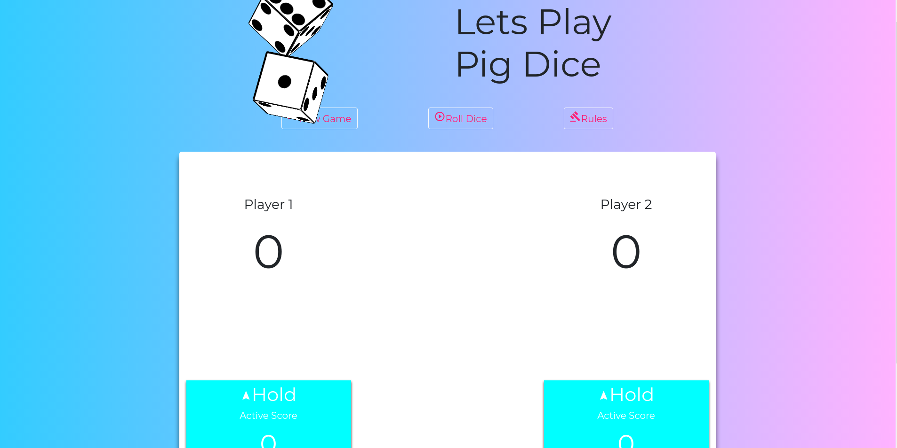

Pig Dice Game
=======================

**Thi is a dice game whereby on a turn, a player1 rolls the die repeatedly until either:
- 1 is rolled
- The player chooses to hold (stop rolling)

If the player chooses to hold, all of the points rolled during that turn are added to his or her score.

First Player to score 50 points Wins!!**

## Specifications
-----------------
-  The game generates a random number between 1 & 6 when the roll dice button is pressed and ties this to the corresponding dice face image. This number is then updated in the Hold button as an active score.
  * Example random number generated when dice button is pressed: 5
  * Example dice image output: 5
  * Example Hold button output: 5

- When a player decides to hold the values in the Hold button, the score is updated to the main score field below the Player title.
  * Example Hold button output: 5
  * Example main score field: 5

- When a player holds or rolls one, the application deactivates the previous player's side by:
  * Turning previous player side a light green/yellow shade if they hold.
  * Turning previous player side a red if they roll one.

- When a player holds and the main score is equal to or greater than 50, the winning players side turns green.

- The "New game" button sets everything back to default.

- The "Rules" button explains the gameplay.

### What we used
This site was build using  
1. `HTML`
2. `CSS`
3. `JavaScript`
4. `jQuery`
5. `Animate.css`
6. `Bootstrap`.

Click [here](https://samngigi.github.io/Pig-Dice/) to see the site.

------------

### Credits

Sam Ngigi.
Nicole.
------------

License
-------

MIT License

Copyright (c) [2017] [Sam Ngigi]

Permission is hereby granted, free of charge, to any person obtaining a copy
of this software and associated documentation files (the "Software"), to deal
in the Software without restriction, including without limitation the rights
to use, copy, modify, merge, publish, distribute, sublicense, and/or sell
copies of the Software, and to permit persons to whom the Software is
furnished to do so, subject to the following conditions:

The above copyright notice and this permission notice shall be included in all
copies or substantial portions of the Software.

THE SOFTWARE IS PROVIDED "AS IS", WITHOUT WARRANTY OF ANY KIND, EXPRESS OR
IMPLIED, INCLUDING BUT NOT LIMITED TO THE WARRANTIES OF MERCHANTABILITY,
FITNESS FOR A PARTICULAR PURPOSE AND NONINFRINGEMENT. IN NO EVENT SHALL THE
AUTHORS OR COPYRIGHT HOLDERS BE LIABLE FOR ANY CLAIM, DAMAGES OR OTHER
LIABILITY, WHETHER IN AN ACTION OF CONTRACT, TORT OR OTHERWISE, ARISING FROM,
OUT OF OR IN CONNECTION WITH THE SOFTWARE OR THE USE OR OTHER DEALINGS IN THE
SOFTWARE.
